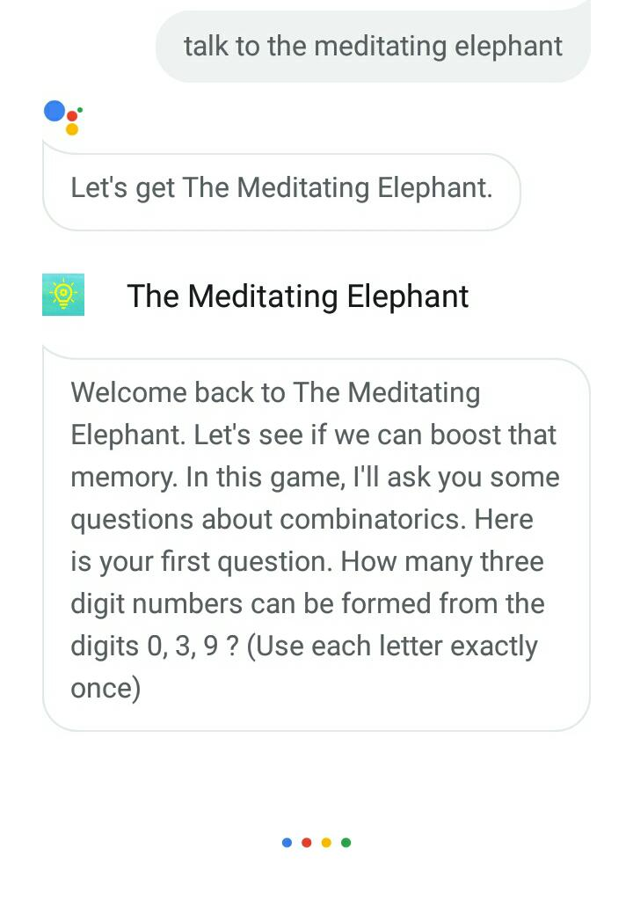

# The Meditating Elephant
The Meditating Elephant is an 'Action on Google'.  
It has been officially launched to all the Google Assistant users, on all devices. 

To access it, take a device with the Google Assistant. Then say,   
"OK Google"  
"Talk to The Meditating Elephant"  

It is a simple game to practice some intriguing combinatorics questions.  
The Meditating Elephant was built on the 'Actions Console', which is the platform for developers to extend the Google Assistant.

# In Action:
The Meditating Elephant

Logo:

Invocation:

Main Page:

# Authors:
Srinidhi Ayyagari

# Acknowledgement:
Big thanks to the Beta users: Amandeep Kaur, Drishti Gupta, Divya Pant, Swapniil Kanwar.
Would also like to thank the resources on Youtube and Stack Overflow always! :)

